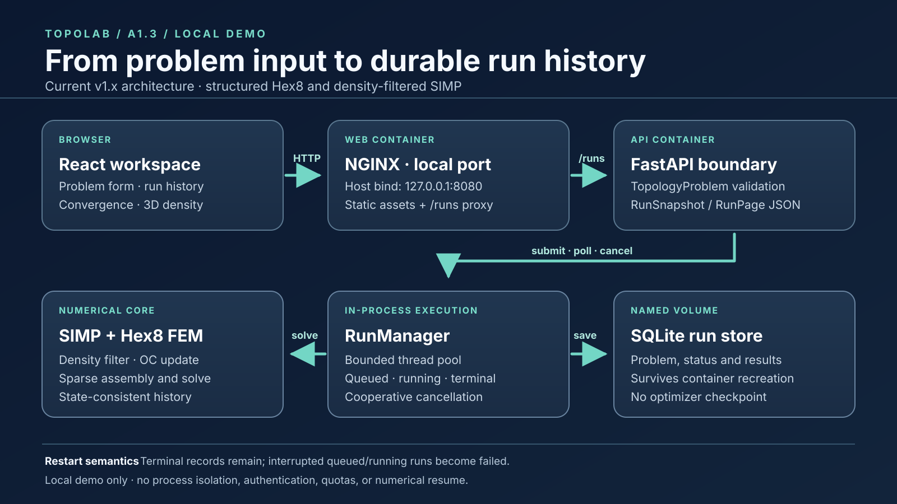

# Local demo architecture

This original diagram describes the v1.x local Compose path. It is a map of the
implemented code and the frozen contracts, not a proposed worker architecture.

| Boundary | Responsibility | Source or contract |
|---|---|---|
| React workspace | Submit a typed problem, show run history and progress, request cancellation, and display convergence and final physical density | [`frontend/src/App.tsx`](../frontend/src/App.tsx), [`docs/frontend.md`](frontend.md) |
| NGINX web container | Serve compiled assets on the host's loopback port and proxy `/runs` on the same origin | [`docker/nginx.conf`](../docker/nginx.conf), [`compose.yaml`](../compose.yaml) |
| FastAPI | Validate `TopologyProblem` and return `RunSnapshot` and `RunPage` JSON | [`src/topolab/api.py`](../src/topolab/api.py), [`docs/platform_contract.md`](platform_contract.md) |
| `RunManager` | Own the bounded in-process thread pool, private run state, progress callbacks, and cooperative cancellation | [`src/topolab/jobs.py`](../src/topolab/jobs.py) |
| Numerical core | Apply the density filter and OC update, assemble Hex8 stiffness, solve the sparse system, and record state-consistent history | [`src/topolab/simp.py`](../src/topolab/simp.py), [`src/topolab/fem.py`](../src/topolab/fem.py), [`docs/numerical_conventions.md`](numerical_conventions.md) |
| SQLite | Persist problem, status, progress, and terminal result on a Docker named volume | [`src/topolab/persistence.py`](../src/topolab/persistence.py), [`docs/run_persistence.md`](run_persistence.md) |

The browser posts to `/runs` and polls one run by ID. The API submits work to the
manager, which persists lifecycle transitions and calls the same numerical core
used by library callers. A cancellation request sets a token observed between
optimization iterations; it cannot interrupt an in-progress sparse solve. On API
restart, terminal records retain their state. Persisted queued or running records
become failed with an interruption error. That is record recovery, not optimizer
checkpoint/resume.

The A1.1 canonical CLI is a separate local entry point that uses `RunManager`
without the web stack and writes its JSON snapshot outside Git. M0/M1/M2 experiment
artifacts and model checkpoints are also outside this demo path and are not packed
into the containers. The local stack has no authentication, process-isolated worker,
quota system, or hosted-service guarantee.

The architecture is shown in the [recorded demo](demo.md). The numerical and
platform release boundaries are summarized in
[`docs/validation/v1_release_validation.md`](validation/v1_release_validation.md);
the Compose smoke is in
[`docs/validation/a1_2_local_stack.md`](validation/a1_2_local_stack.md).
